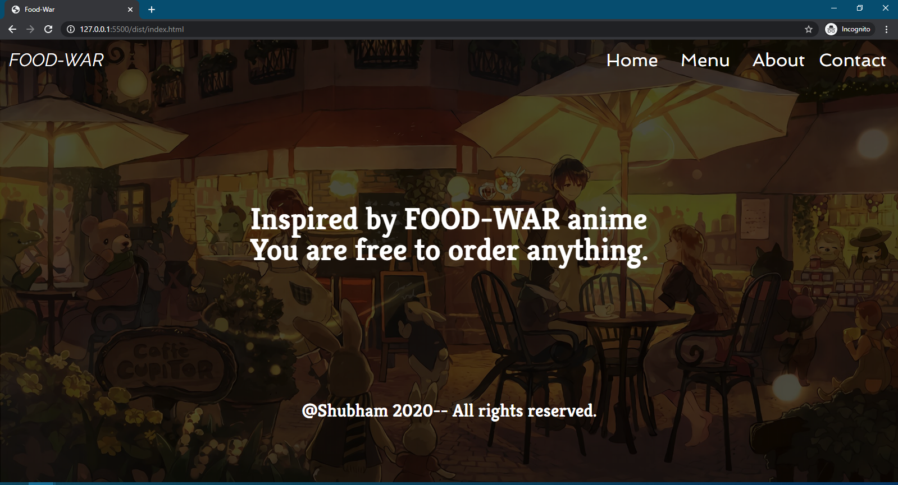
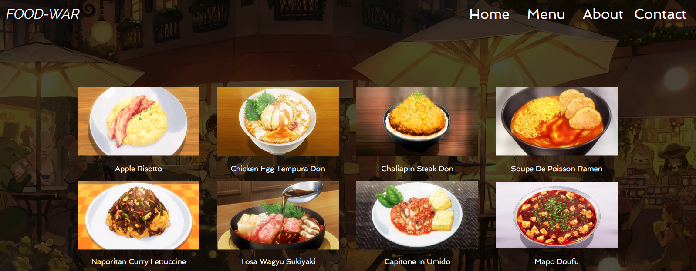
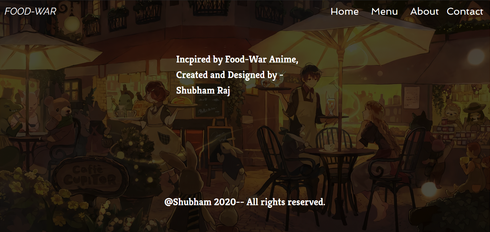
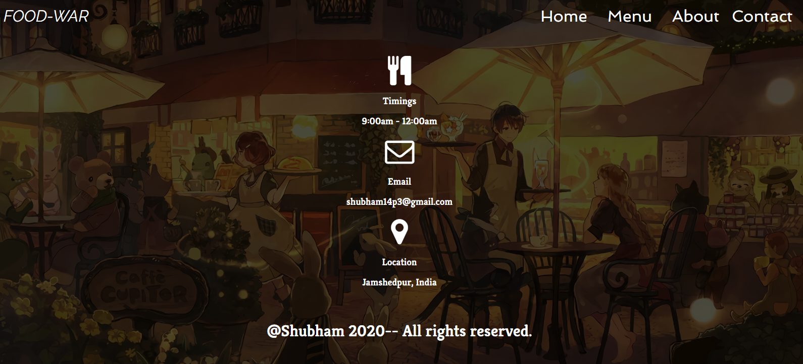

# Resturant Page with Javascript

[![Contributors][contributors-shield]][contributors-url]
[![Forks][forks-shield]][forks-url]
[![Stargazers][stars-shield]][stars-url]
[![Issues][issues-shield]][issues-url]

In this project,we are building a simple restaurant homepage made on Javascript. It is created with the help of ES6 modules, Webpack and much more. In this project we are continuly practicing DOM manipulation by dynamically rendering a simple restaurant homepage! By the end, we are going to be using JavaScript alone to generate the entire contents of the website!

### Landing Page



### Menu Page



### About Page



### Contact Page



## Built With
​
- HTML
- CSS
- JavaScript

## Getting Started
​
To get started with the app, cd to the directory where you would like the repo to live by typing on your terminal:
​
Clone the repo typing :
​
```
$git clone https://github.com/shubham14p3/Javascript-Restaurant-Page.git
```

run the following command
```
$npm run build
```
open up the index file using any live server

## Authors

👤 **Shubham Raj**

- Github: [@ShubhamRaj](https://github.com/shubham14p3)
- Linkedin: [Shubham14p3](https://www.linkedin.com/in/shubham14p3/)

## 🤝 Contributing

Contributions, issues and feature requests are welcome!

Feel free to check the [issues page](https://github.com/shubham14p3/Javascript-Restaurant-Page/issues/).

## Show your support

Give a ⭐️ if you like this project!

## Acknowledgments

- Project requested by [Microverse Program](https://www.microverse.org/).

## Future Enhancement

- Adding API Calls for Tracking, Gmap, etc.
- Adding Payment Gateways.
- Adding Responsivness to the project.

<!-- MARKDOWN LINKS & IMAGES -->

[contributors-shield]: https://img.shields.io/github/contributors/shubham14p3/Javascript-Restaurant-Page.svg?style=flat-square
[contributors-url]: https://github.com/shubham14p3/Javascript-Restaurant-Page/graphs/contributors
[forks-shield]: https://img.shields.io/github/forks/shubham14p3/Javascript-Restaurant-Page.svg?style=flat-square
[forks-url]: https://github.com/shubham14p3/Javascript-Restaurant-Page/network/members
[stars-shield]: https://img.shields.io/github/stars/shubham14p3/Javascript-Restaurant-Page.svg?style=flat-square
[stars-url]: https://github.com/shubham14p3/Javascript-Restaurant-Page/stargazers
[issues-shield]: https://img.shields.io/github/issues/shubham14p3/Javascript-Restaurant-Page.svg?style=flat-square
[issues-url]: https://github.com/shubham14p3/Javascript-Restaurant-Page/issues
